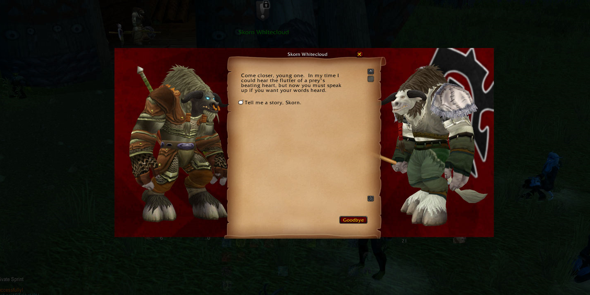

# Frostfire Quest Frames

**Version 0.2c**

An immersive quest and gossip dialogue replacement for **World of Warcraft: Wrath of the Lich King (3.3.5a enUS client)**.

I tried using some backports of popular quest frame immersion addons and they generally work great but wanted to try to make something for myself and spent a morning vibe coding my own version. The code is very messy. If anyone wants to use this feel free. If anyone wants to clean this up be my guest. (A shoutout would be appreciated!)

---

## What It Does

Replaces the default quest and gossip windows with a more immersive dialogue experience:

- **Faction-themed backgrounds** — Horde, Alliance, or neutral background based on the NPC you're talking to, falling back to your player's faction if the NPC's can't be determined.
- **Live 3D model viewers** — your character and the NPC are displayed flanking the dialogue pane, mirroring their in-world appearance.
- **Animated conversation** — player model plays talk, question, nod, point, and other gestures while dialogue is open.
- **Parchment text area** — quest and gossip text is displayed on a centered parchment background.
- **Full gossip support** — works with quest givers, gossip NPCs, bankers, innkeepers, and other single-option NPCs that would normally skip the gossip frame.
- **Non-humanoid camera profiles** — giants, dragonkin, beasts, elementals, and totems are framed appropriately.
- **Animation fallback system** — models with problematic rigs automatically use a safe animation path.
- **Options panel** — configure faction backgrounds via Escape → Interface → AddOns → Frostfire Quest Frames. Selections persist between sessions.

---

## Commands

`/ffqf hide` — force close the frame  
`/ffqf config` — open the options panel directly  
`/ffqf reset` — reset internal sizing flags (use if layout looks wrong after UI reload)  
`/ffqf animdebug` — print animation and camera profile debug info for your current target to chat

---

## Options

Open via **Escape → Interface → AddOns → Frostfire Quest Frames** or type `/ffqf config`.

- **Horde Background** — texture shown when talking to a Horde NPC
- **Alliance Background** — texture shown when talking to an Alliance NPC
- **Neutral / Unknown Background** — texture shown for neutral NPCs and object interactions

Changes take effect on the next NPC interaction after clicking Okay.

---

## Adding More Background Textures

To add new background options to the panel:

1. Drop a TGA file (1024x512, power-of-two) into the `Art/` folder.
2. Add an entry to the `CUSTOM_TEXTURES` table in `FrostfireQuestFrames.lua`:

```lua
{ label = "Scourge", key = "custom:scourge", path = ART .. "scourge.tga" },
```

The new option will appear as a button in the options panel automatically.

---

## Credits & Inspiration

**Storyline** by Sylvain Cossement
- Animation technique using `SetSequenceTime` driven by an OnUpdate loop, and the `playAndStand` pattern for returning models to idle after an animation completes
- WotLK 3.3.5a backport by Lanrutcon, Shadovv, and centurijon
- https://www.curseforge.com/wow/addons/storyline

**Immersion** by MunkDev
- https://www.curseforge.com/wow/addons/immersion

**DialogueUI** by Peterdox
- For the parchment layout and overall dialogue aesthetic
- https://www.curseforge.com/wow/addons/dialogueui

**New Quest Frame** by reative_pl
- For faction-specific backgrounds
- https://www.wowinterface.com/downloads/info22317-NewQuestFrame.html

**Gossiper** by Wazzak
- The `ForceGossip` override technique to prevent single-option NPCs from bypassing the gossip frame
- https://www.wowinterface.com/downloads/info22819-Gossiper.html

**Background textures** — original artwork by MikeFirestrike.

---

## Requirements

- World of Warcraft client version **3.3.5a** (Wrath of the Lich King - enUS). Will likely crash and burn with other clients.

---

## Installation

1. Extract the `FrostfireQuestFrames` folder into your `Interface/AddOns/` directory.
2. Reload your UI or log in.
3. The addon activates automatically whenever you interact with a quest giver or gossip NPC.

---

## Notes

- Addon forces gossip options open on startup so single-option NPCs don't skip the frame. This is intentional. IMMERSION.
- Short freezes on models after playing animations are a known 3.3.5a `SetSequenceTime` limitation. Generally tolerable.
- Designed for 1920x1080 resolution. Your mileage may vary.
- Faction backgrounds are 1024x512 TGA format. Replace or add textures in the `Art/` folder and register them in `CUSTOM_TEXTURES`.
- The inner parchment (`ParchmentBG.tga`) is 512x512 and can also be replaced.
- All textures must be power-of-two dimensions and in TGA or BLP format.

---

## Changelog

### v0.2c
- Fixed background texture not updating correctly when switching back to a previously used faction background (stacked texture objects were being created on each panel Okay)

### v0.2b
- Fixed background texture selection not persisting — pending table was being replaced rather than cleared in place, breaking closure references
- Removed LibSharedMedia dependency — background selection now uses simple buttons backed by the built-in texture registry
- Background textures are original artwork by MikeFirestrike

### v0.2a
- Added options panel (Escape → Interface → AddOns → Frostfire Quest Frames / `/ffqf config`)
- Faction backgrounds now configurable per slot (Horde / Alliance / Neutral) with live preview, saved between sessions
- Camera profiles for non-humanoid NPCs: giants/dragonkin zoom out, beasts/mechanicals zoom in, elementals use wide framing, totems/objects hide the NPC model
- Animation fallback system for models with problematic rigs
- Sequence 60 (Talk) removed from NPC animation pool — caused stuttering on certain models
- NPC model facing fixed — profile applied before SetUnit so model load doesn't override orientation
- `QuestFrameCompleteButton` nudged down and scroll frame bottom boundary raised to prevent reward item overlap
- Added `/ffqf animdebug` for in-game diagnostics
- Added `/ffqf config` shortcut
- `SavedVariables: FQFConfig` added to TOC

### v0.1
- Initial release
